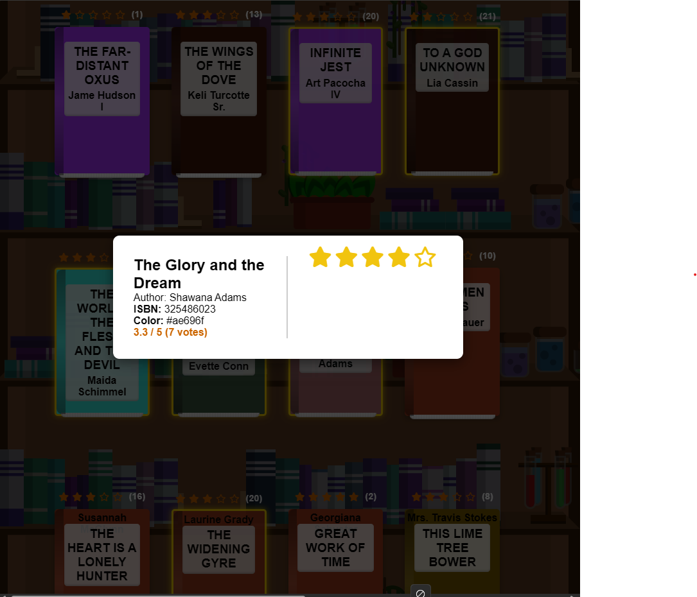

# Book Rating Site with Spring Boot

  
  

Aufgabe: Erstellen Sie eine Spring Boot-Anwendung für die Verwaltung von
Benutzerbewertungen für Bücher.
Beschreibung: Erstellen Sie eine Spring Boot-Anwendung, die es Benutzern
ermöglicht, Bewertungen für Bücher abzugeben und anzuzeigen. Die Anwendung
sollte alle wichtige Annotationen, CDI-Konfiguration, Logging, Spring Web MVC
und Thymeleaf verwenden. Sie sollten die Java Faker-Bibliothek verwenden, um
Testdaten zu generieren, und die Daten im Application Scope oder Session Scope
speichern. Versuchen Sie folgende Schritte einzuhalten:

1. Projekt erstellen:
• Erstellen Sie ein neues Spring Boot-Projekt mit Spring Initializer mit
Maven optional mit Gradle
• Fügen Sie die erforderlichen Abhängigkeiten für Spring Web,
Thymeleaf, Logging (z. B. SLF4J), und Java Faker hinzu.

2. Datenmodell erstellen:
• Erstellen Sie eine Klasse Book mit Attributen wie id, title,
author, isbn etc.
• Erstellen Sie eine Klasse BookRating mit Attributen wie id,
bookId, userId, rating, etc..

3. Fake-Daten generieren:
• Verwenden Sie die Java Faker-Bibliothek, um einige Testdaten für
Bücher zu generieren, und speichern Sie sie im Anwendungsbereich
(Application Scope).

4. Benutzerbewertungen verwalten:
• Implementieren Sie eine Möglichkeit, Benutzerbewertungen für Bücher
hinzuzufügen und anzuzeigen. Verwenden Sie dazu Sessionscope oder
Anwendungsscope, um Bewertungen zu speichern.

5. Thymeleaf-Templates erstellen:
• Erstellen Sie Thymeleaf Templates für die Benutzeroberfläche, um
Bücher und Bewertungen anzuzeigen und Benutzerbewertungen
hinzuzufügen.

6. Controller erstellen:
• Erstellen Sie Controller-Klassen für das Anzeigen von Büchern, das
Anzeigen von Bewertungen und das Hinzufügen von Bewertungen.7. Logging hinzufügen:
• Fügen Sie Logging in Ihrer Anwendung hinzu, um wichtige Ereignisse
zu protokollieren, z. B. das Hinzufügen von Bewertungen oder
Fehlermeldungen.
• Verwenden Sie SLF4J mit einer Implementierung wie Logback oder
Log4j.

8. CDI-Konfiguration:
• Konfigurieren Sie Spring-Beans und -Komponenten in Ihrer
Anwendung, indem Sie Annotationen wie @Component, @Service,
@Controller, @Beans usw. verwenden